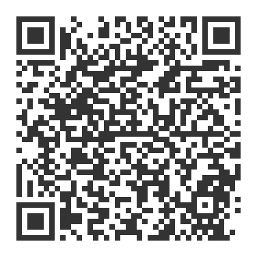

# 자막 변환기 — 독립 안드로이드 앱 (APK)

**폰만으로 동작하는 진짜 설치형 앱**을 목표로 합니다. PWA(홈 화면 추가)와 달리
PC가 필요 없습니다. 유튜브 오디오 추출 + 한국어 음성 인식을 **폰 안에서** 합니다.

## 📥 폰으로 받기 — QR 스캔 한 번



**폰 카메라로 위 QR을 비추면** APK 다운로드가 바로 시작됩니다.
또는 폰 브라우저에서 이 주소를 여세요:

**https://github.com/rainbowww/skills/releases/download/android-latest/subtitle-converter.apk**

### 설치 3단계 (개발자 아니어도 됩니다)
1. QR 스캔(또는 위 링크) → `subtitle-converter.apk` 다운로드
2. 다운로드 알림을 **탭 → 설치**
3. "이 출처의 앱 허용" 창이 뜨면 **허용** 한 번 → 홈 화면에 **자막 변환기** 아이콘 생김

> 항상 **최신 빌드**가 같은 링크로 자동 갱신됩니다(`android-latest` 릴리스).
> 로그인·압축해제 필요 없이 바로 클릭 설치돼요.

<details>
<summary>다른 방법: Actions 아티팩트 / 태그 릴리스</summary>

- **Actions 아티팩트:** 저장소 Actions → “Android APK (subtitle converter)” → 최근 실행 →
  Artifacts의 `subtitle-converter-apk` (GitHub 로그인 필요, zip 압축 해제).
- **버전 릴리스:** `v*` 태그를 밀면 그 버전 Releases에도 `.apk` 가 첨부됩니다.
</details>

## 개발 단계 (한 번 만들면 계속 개선)

- [x] **1단계** — 설치되는 진짜 APK + 화면 + 유튜브 주소 인식 (CI 빌드/설치 검증)
- [ ] **2단계** — NewPipeExtractor 로 폰에서 오디오 추출
- [ ] **3단계** — whisper.cpp 온디바이스 한국어 음성 인식 → 자막 + TXT 저장
- [ ] **4단계** — 타임스탬프·검색·글자 크기 등 웹앱 기능 이식

## 로컬에서 직접 빌드하려면 (안드로이드 스튜디오 있는 PC)

```bash
# 대상(실행 위치): 🟩 Android SDK 설치된 Linux·macOS 터미널
cd youtube-subtitle-converter/android
gradle :app:assembleDebug        # 또는 Android Studio에서 열고 Run
# 결과: app/build/outputs/apk/debug/app-debug.apk
```

구조: `app/`(단일 모듈), 언어 Kotlin, `minSdk 26`, `compileSdk 34`.
동작은 웹앱과 일치시키려 `parse_video_id` 정규식을 그대로 옮겼습니다.
